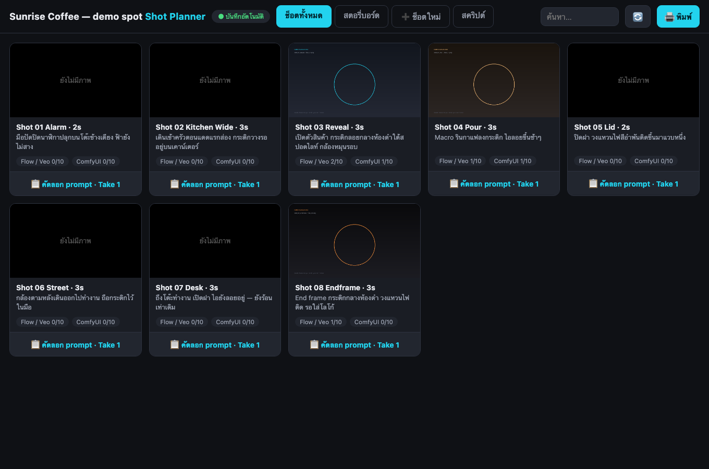
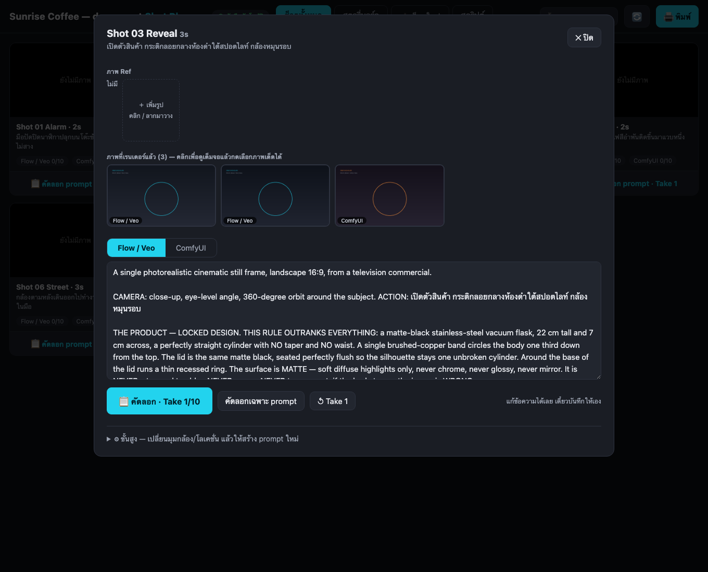
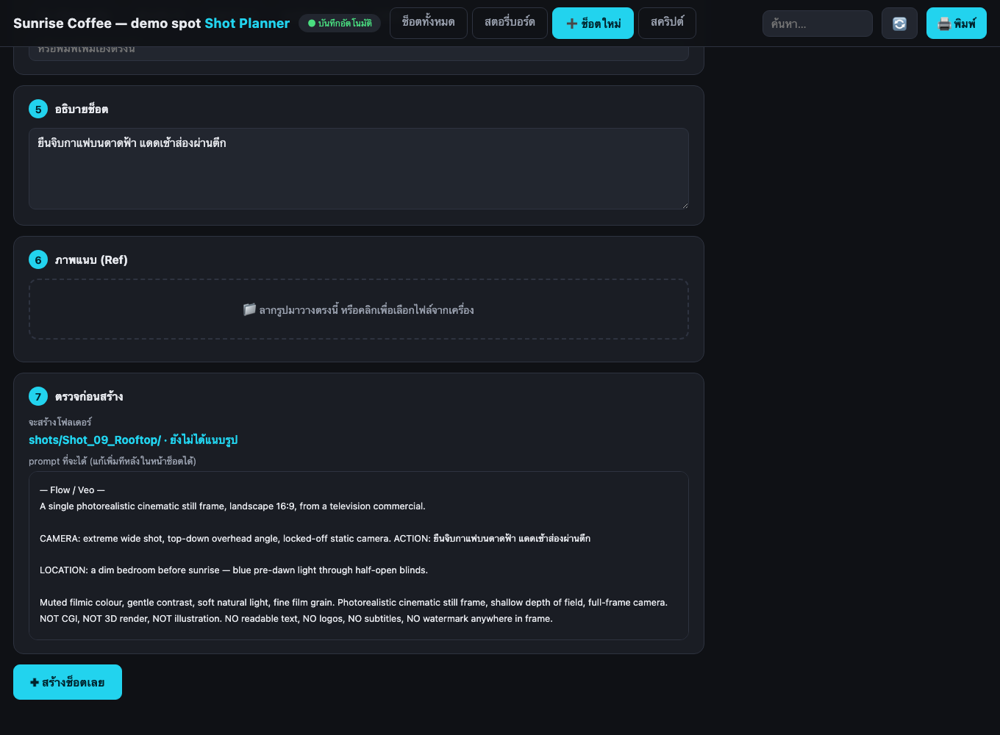

# Gimmick Shot Planner

A tiny, dependency-free shot planner for AI film and TVC production. One Python file, one HTML file,
one `project.json`. It turns a shot list into consistent prompts, keeps every rendered frame next to
the shot it belongs to, and prints a client-ready storyboard.

**[อ่านภาษาไทยที่นี่ / Thai version →](README.th.md)**



## Why

When you generate a 40-shot spot with Flow / Veo / ComfyUI / Midjourney, the real work is not the
prompting — it is keeping 400 images, 40 prompts and one locked product design from drifting apart.
This does that, and nothing else:

- **One locked style block** — your product description, film grade and negatives are written once and
  glued onto every prompt, so shot 39 still looks like shot 1.
- **Prompts are generated, not copy-pasted** — pick shot size, angle, move, location and product state
  from chips; the prompt is rebuilt from your own templates.
- **One button per shot** — copy the prompt with an automatic *Take 1…10* lens/light variation appended,
  so re-rolls are deliberate instead of random.
- **Renders live next to the shot** — drop `flow_07.png` in the shot folder and the card counts it.
  Star the good ones full screen; the starred frame becomes the storyboard thumbnail.
- **Storyboard → PDF** — Print → Save as PDF. That is the deliverable.
- **Everything is plain files.** `project.json` + one folder per shot. No database, no account, no cloud.

## Quick start

You need Python 3.8+ and a browser. Nothing else — no pip install.

```bash
git clone https://github.com/miniboxseries/gimmick-shot-planner.git
cd gimmick-shot-planner
python3 shot_planner.py            # opens http://127.0.0.1:8765/ in your browser
```

On macOS you can just double-click **Start Planner.command**. On Windows, **start.bat**.

The repo ships with a small demo project (a coffee-flask spot) so you can see it working. Delete
`shots/*` and rewrite `project.json` when you start your own film.

> Keep it open at `http://127.0.0.1:8765/` — opening `planner.html` as a `file://` path gives you a
> read-only view (the page will offer to jump to the server for you).

## The four tabs

| Tab | What it does |
|---|---|
| **All shots** | Every shot as a card: thumbnail, description, render counts per channel, one-click prompt copy |
| **Storyboard** | Print layout, 3 across — Print → Save as PDF for the client |
| **New shot** | A 7-step form: name, camera, scene, cast, description, reference images, preview → creates the folder and prompt files |
| **Script** | Your `script.txt`, shown next to the shots |

Click any card to open the shot: reference images, every render, the prompt per channel, and an
**Advanced** section where changing a chip rebuilds the prompt and saves itself.





## How a prompt is built

Each **channel** (an image tool you use) has a template. Two shapes are built in:

- `"style": "full"` — a paragraph prompt for Flow / Veo / GPT Image / Nano Banana
- `"style": "tags"` — a comma-separated prompt for ComfyUI / SDXL / Krea

Both are assembled from the same shot, so the two stay in sync. Write your own with `"template"`:

```json
{ "id": "mj", "label": "Midjourney", "prefix": "mj_", "target": 4,
  "template": "{action}, {loc_short}, {size} {angle}, {product_short} --ar 16:9 --style raw" }
```

Placeholders available in a template:

| | |
|---|---|
| `{head}` `{tail}` `{tail_short}` | your global opening / closing style text |
| `{size}` `{angle}` `{move}` `{loc}` `{loc_short}` | the picked camera + location, in prompt English |
| `{product}` `{product_short}` `{state}` `{state_short}` | the locked product block and its current state — all empty when the shot's state is `na` |
| `{action}` `{desc}` `{cast}` `{sec}` `{folder}` | what you typed for this shot |
| `{camera_line}` `{action_line}` `{location_line}` `{people_line}` | pre-composed lines that disappear when empty |

Unknown placeholders render as empty text instead of crashing, and blank lines collapse — so a shot
with no product and no cast still produces a clean prompt.

## project.json

The only file you edit. Everything below is optional except `shots`.

| Key | Meaning |
|---|---|
| `name` | shown in the header |
| `lang` | `th` or `en` — the UI language |
| `port` | default `8765` |
| `shots_dir` `sheets_dir` `script_file` | folder names, if you want different ones |
| `channels` | the image tools you use: `id`, `label`, `prefix` (render filename prefix), `target` (how many per shot), `style` or `template` |
| `prompt.head` / `.tail` / `.tail_short` | global style text glued onto every prompt |
| `product` | `label`, `block` (your locked design paragraph), `short` (tag version) |
| `options.sizes/angles/moves/locs/states` | the chips. Each is `{id, label, en, short?}` — `label` is what you see, `en` is what goes in the prompt |
| `cast_presets` | quick buttons in the cast row |
| `takes` | the variation lines appended when you copy — Take 1…N |
| `shots` | the shot list; each is `{folder, sec, size, angle, move, loc, state, cast, desc, action?, picks?}` |

`states` is how you lock a product's on-screen condition (lid closed / lit / not in this shot).
Set a shot's state to `na` and the product block is left out of that shot's prompt entirely.

## Files on disk

```
project.json              your film: options, style blocks, shot list
script.txt                shown in the Script tab
sheets/                   character / product / location sheets, pickable as references
shots/
  Shot_03_Reveal/
    prompt_flow.txt       generated, editable
    prompt_comfy.txt
    ref/                  reference images for this shot
    flow_01.png           anything starting with a channel prefix is counted as a render
    comfy_01.png
```

Renders are matched by filename prefix — name them `flow_01.png`, `comfy_07.png`, and the card counts
them. Nothing needs importing.

## Command line

```bash
python3 shot_planner.py            # start (default)
python3 shot_planner.py daemon     # start without opening a browser
python3 shot_planner.py build      # write prompt files for every shot that has none
python3 shot_planner.py build -f   # rebuild every prompt from project.json
python3 shot_planner.py scan       # refresh planner_data.js (the read-only fallback)
```

`build` is the fast way to bootstrap: write your whole shot list into `project.json`, run it once, and
every shot folder gets its prompts.

## Notes

- **Nothing leaves your machine.** The server binds to `127.0.0.1` only.
- **Edits save themselves** to `project.json` (written atomically) about a second after you stop typing.
- **Editing `project.json` by hand while the planner is open is fine** — hit 🔄 and it reloads.
- **Auto-start on macOS:** a LaunchAgent running `/usr/bin/python3` cannot read `~/Desktop`,
  `~/Documents` or `~/Downloads` unless you add that Python binary to
  *System Settings → Privacy & Security → Full Disk Access*. Either grant it, keep the project
  elsewhere, or just double-click **Start Planner.command** when you need it.

## Use this as a template

Click **Use this template** at the top of the repo to start a new film with its own history, or just
clone it — one repo per project works well, since `project.json` and `shots/` *are* the project.

## License

MIT — see [LICENSE](LICENSE). Built by [Gimmick Studio](https://github.com/miniboxseries).
